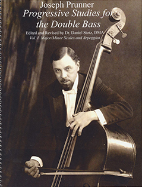

##NOW AVAILABLE

_**Progressive Studies for the Double Bass by Joseph Prunner**_

revised and edited by Dr. Daniel Stotz

Volume I: Major/Minor Scales and Arpeggios (327 pp.)
**Click here to order:**
[Volume I]( http://www.amazon.com/dp/B00L3YLKCO/?tag=becbot-20)

Volume II -- Chromatic Scales and Fixed-Position Major and Minor Scales and Arpeggios (138 pp.)

**Click here to order:**
[Volume II]( http://www.amazon.com/dp/B00L4O8U12/?tag=becbot-20)

**Click here to order both**
[Volumes I & II together](http://www.amazon.com/dp/B00L4ONTCC/?tag=becbot-20)

The legacy of great Austrian-born double-bassist and pedagogue Joseph Prunner (1886–1969) includes his scale and arpeggio exercise book, _Progressive Studies for the Double Bass_, composed in 1955 for Prunner’s students at the Bucharest Conservatoire and edited by his pupil Ion Cheptea.

The _Studies_ present major and minor scales (harmonic and melodic) performed first in one octave then extended diatonically through all their modes. This pattern continues to progress through three octaves, followed by a series of arpeggios. Exercises are based on a modernized fingering system and are offered in both the traditional positions and in what Prunner called “Fixed-Position” scales. A series of chromatic scale exercises follow the template of the major and minor scales.

Daniel Stotz’s new edition is a comprehensive revision and expansion of Prunner’s _Studies_ preserving the original information, correcting errors made in editing, and greatly expanding the study by increasing the range of the exercises. More arpeggio exercises are provided -- creating melodic and harmonic minor “Fixed-Position” scales and arpeggios --  as well as the study of double-stops.

“A newly revised and complete edition of this incredible scale and arpeggio system…the Prunner that I know, but new and on steroids!” – Catalin Rotaru, Associate Professor of Double Bass, Arizona State University in _Bass World_

“Bassists, if you buy nothing else this year, buy these…two magnificent volumes of scales and arpeggios for the 21st century…a must for anyone who is serious about developing a strong technique throughout the entire range of the double bass.” – David Heyes in _Stringendo_ for the Australian Strings Association (AUSTA)
